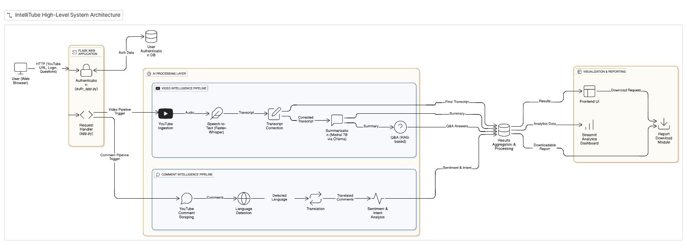
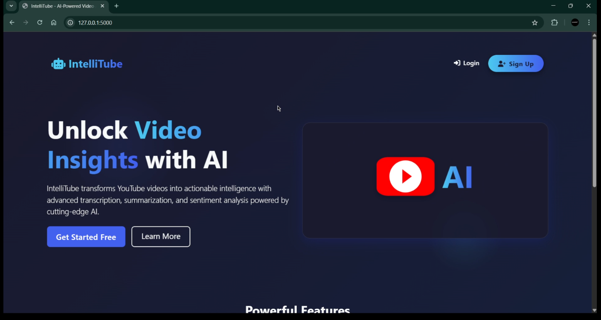
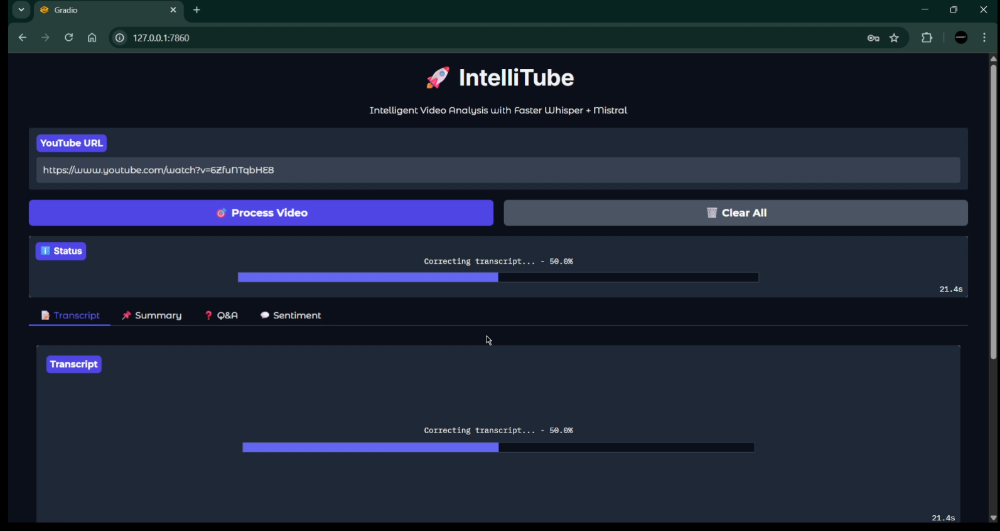

# Intellitube 

IntelliTube is a full‑stack, privacy‑first AI system that converts YouTube videos into actionable knowledge. It combines speech‑to‑text, transcript correction, summarization, retrieval‑augmented question answering (RAG), and large‑scale comment sentiment & intent analytics with both Gradio and Streamlit dashboards.

The entire AI pipeline runs locally using open‑source models (**Faster‑Whisper**, **Mistral**, **HuggingFace Transformers**), making IntelliTube suitable for research, education, and enterprise use cases where data privacy matters.


##  Features

-    High‑speed YouTube transcription using Faster‑Whisper
-    AI‑based transcript correction for grammar & readability
-    Automatic long‑video summarization using local LLMs
-    Ask questions over videos (RAG‑based QA)
-    Scrape YouTube comments at scale
-    Deep sentiment analysis (Positive / Neutral / Negative)
-    Intent & emotion classification (Praise, Complaint, Concern, etc.)
-    Advanced interactive analytics dashboard (Streamlit + Plotly)
-    Export results as JSON / PDF / CSV
-    User authentication system (Flask + MongoDB)

---

##  System Architecture (Pipeline Overview)
-   User submits a YouTube URL
-   Audio is downloaded via yt‑dlp
-   Faster‑Whisper transcribes the audio
-   Transcript is cleaned using a local LLM correction layer
-   Clean transcript is **summarized** &  indexed into a **FAISS vector store**
-   Users ask questions → RAG pipeline retrieves relevant chunks → Mistral LLM answers
-   Comments are scraped, translated (if needed), and analyzed for **sentiment (RoBERTa)** & **intent/emotion (DistilBERT)**
-   Results are visualized via Streamlit analytics dashboard
    
---
---
##  System Design Architecture

The following diagram illustrates the end-to-end architecture of **IntelliTube**, showing how user requests flow through transcription, LLM processing, analytics, and visualization layers.



---
##  Authentication Module

IntelliTube includes a secure authentication system built using **Flask and MongoDB**, allowing users to sign up and log in before accessing analysis features.



---

##  Main Application

The main Application Intellitube running on **Gradio Interface** 



---


##  Project structure

```bash

Intellitube/
├── Readme.md                # Project documentation
├── requirements.txt         # Python dependencies
│
├── app.py                   # Main app: runs the full pipeline + Gradio interface
├── auth_app.py              # User login/signup system using Flask + MongoDB
│
├── fast_transcriber.py      # Faster-Whisper based YouTube audio transcriber
├── transcriber.py           # Alternative/legacy transcription module
├── transcorrection.py       # Fixes transcription errors using local Mistral
├── summarizer.py            # Summarizes transcripts using Mistral via Ollama
├── qa_chain.py              # Q&A engine using FAISS + embeddings + Mistral
│
├── ytcom.py                 # YouTube comment scraper + translation
├── ytsenti.py               # Sentiment + intent analysis on YouTube comments
│
├── dashboard/
│   ├── dash.py              # Streamlit dashboard for sentiment visualization
│   └── style.css            # Dashboard styling
│
└── templates/
    ├── home.html            # Main web UI (Flask/HTML frontend)
    ├── login.html           # User login page
    └── signup.html          # User signup page

```
---

##  Web Interface (Frontend)

Beyond the powerful backend, IntelliTube now boasts a custom-built, responsive, and visually appealing frontend for a seamless user experience it is built using Flask, a lightweight and powerful web framework for Python. Key features include:

-   **Modern Design:** Built with **HTML, CSS, and Bootstrap 5**, offering a clean and intuitive layout.
-   **Dynamic Interactions:** Enhanced with **JavaScript** for interactive elements, including password strength validation and form handling.
-   **Authentication System:** Secure and user-friendly **Login and Sign-up pages** to manage user access.
-   **Responsive Layout:** Optimized for various screen sizes, from desktops to mobile devices.

---

##  Getting Started

### 1. Clone the Main Repo
```bash
git clone https://github.com/AtharSayed/Intellitube.git
cd Intellitube
```

### 2. Create environment
```bash
python -m venv venv
source venv/bin/activate # Windows: venv\Scripts\activate
```

### 3. Install dependencies
```bash
pip install -r requirements.txt
```

### 4. Start authentication service
```bash
python auth_app.py
```

### 5. Start IntelliTube UI
```bash
python app.py
```

### 6. (Optional) Start analytics dashboard
```bash
streamlit run dashboard/dash.py
```
